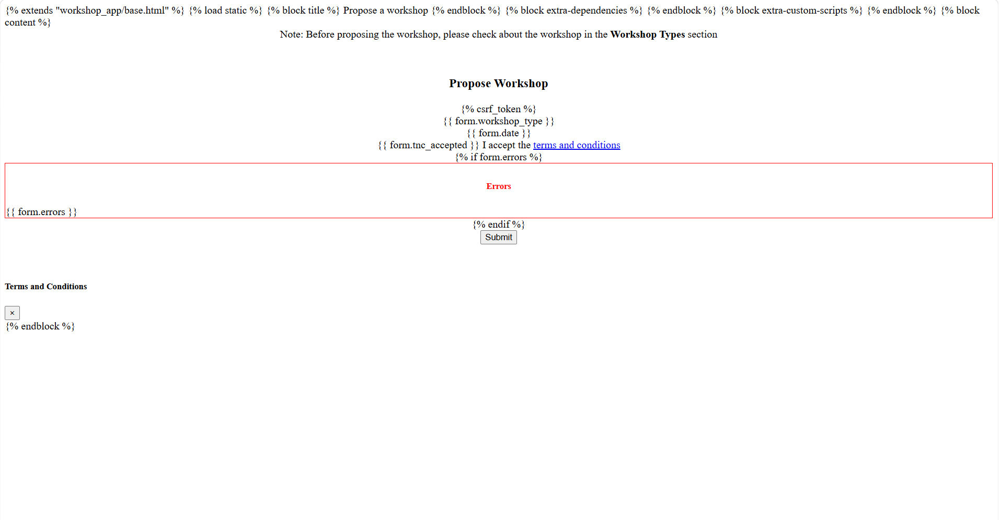
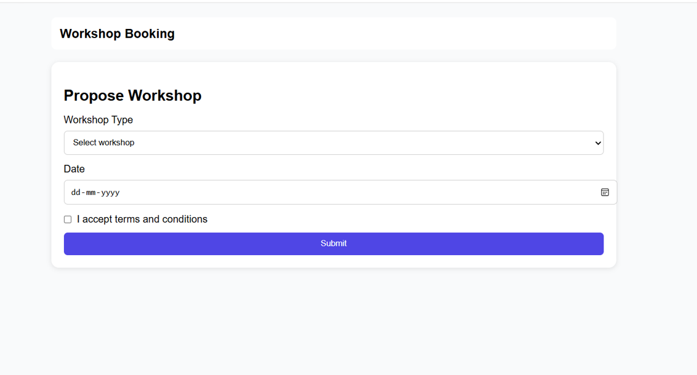

# Workshop Booking UI Redesign (React)

This project focuses on improving the UI/UX of the existing workshop booking system using React. The original system was built using Django templates and had minimal styling. The goal of this task was to redesign the interface to make it more modern, user-friendly, and responsive, especially for students accessing it on mobile devices.

---

## Improvements Made

- Redesigned the UI using React components  
- Introduced a clean card-based layout for better structure  
- Improved form design with proper spacing and labels  
- Added validation and user feedback messages  
- Ensured mobile responsiveness using CSS  
- Simplified the user flow for better usability  

---

## Design Principles

The redesign was guided by simplicity and clarity. I focused on making the interface easy to understand, especially for first-time users. Proper spacing, alignment, and consistent styling were applied to improve readability. A card-based layout was used to visually separate content and improve user focus.

---

## Responsiveness

A mobile-first approach was followed while designing the interface. Flexible layouts and CSS media queries were used to ensure the UI adapts well to smaller screens. Form elements and buttons were designed to be easily accessible and clickable on mobile devices.

---

## Trade-offs

To maintain performance, I avoided using heavy UI libraries and instead used simple CSS for styling. Advanced animations and complex designs were avoided to keep the application lightweight and fast.

---

## Challenges

The most challenging part was understanding the existing Django templates and converting them into React components while keeping the structure intact. Since there was no backend integration, form handling and validation had to be managed within React. I focused on maintaining a balance between improving the UI and keeping the implementation simple.

---

## Before UI

The original UI was minimal and lacked styling.

---

## After UI

The redesigned UI is cleaner, more structured, and responsive.

---

## Setup Instructions

1. Clone the repository  
   `git clone https://github.com/vidhhya1/workshop-booking-ui.git`

2. Navigate to the frontend folder  
   `cd frontend`

3. Install dependencies  
   `npm install`

4. Run the development server  
   `npm start`

---

## Tech Stack

- React (Frontend)  
- CSS (Styling)  

---

## Notes

This project focuses only on UI/UX improvements. Backend functionality was not modified.